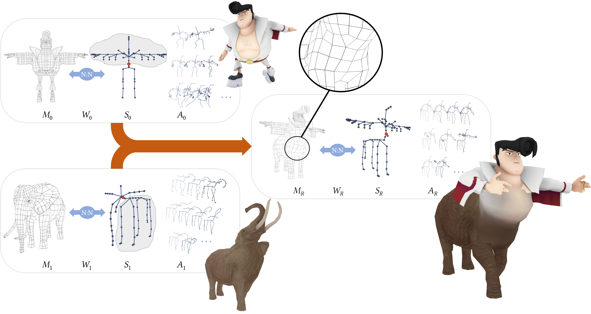

# SkinMixer: Blending 3D Animated Models

Stefano Nuvoli, [Nico Pietroni](https://profiles.uts.edu.au/Nico.Pietroni), [Riccardo Scateni](http://people.unica.it/riccardoscateni/), [Paolo Cignoni](http://vcg.isti.cnr.it/~cignoni/), [Marco Tarini](https://tarini.di.unimi.it/)<br/>
*SIGGRAPH Asia 2022*<br/>



## Abstract
We propose a novel technique to compose new 3D animated models, such as videogame characters, by combining pieces from existing ones. Our method works on production-ready rigged, skinned, and animated 3D models to reassemble new ones. We exploit mix-and-match operations on the skeletons to trigger the automatic creation of a new mesh, linked to the new skeleton by a set of skinning weights and complete with a set of animations. The resulting model preserves the quality of the input meshings (which can be quad-dominant and semi-regular), skinning weights (inducing believable deformation), and animations, featuring coherent movements of the new skeleton.<br/>
Our method enables content creators to reuse valuable, carefully designed assets by assembling new ready-to-use characters while preserving most of the hand-crafted subtleties of models authored by digital artists. As shown in the accompanying video, it allows for drastically cutting the time needed to obtain the final result.

DOI: [10.1145/3550454.3555503](https://doi.org/10.1145/3550454.3555503) ACM Transactions on Graphics (SIGGRAPH Asia) 2022

**BibTex**
```
@article{10.1145/3550454.3555503,
author = {Nuvoli, Stefano and Pietroni, Nico and Cignoni, Paolo and Scateni, Riccardo and Tarini, Marco},
title = {SkinMixer: Blending 3D Animated Models},
year = {2022},
issue_date = {December 2022},
publisher = {Association for Computing Machinery},
address = {New York, NY, USA},
volume = {41},
number = {6},
issn = {0730-0301},
url = {https://doi.org/10.1145/3550454.3555503},
doi = {10.1145/3550454.3555503},
abstract = {We propose a novel technique to compose new 3D animated models, such as videogame characters, by combining pieces from existing ones. Our method works on production-ready rigged, skinned, and animated 3D models to reassemble new ones. We exploit mix-and-match operations on the skeletons to trigger the automatic creation of a new mesh, linked to the new skeleton by a set of skinning weights and complete with a set of animations. The resulting model preserves the quality of the input meshings (which can be quad-dominant and semi-regular), skinning weights (inducing believable deformation), and animations, featuring coherent movements of the new skeleton.Our method enables content creators to reuse valuable, carefully designed assets by assembling new ready-to-use characters while preserving most of the hand-crafted subtleties of models authored by digital artists. As shown in the accompanying video, it allows for drastically cutting the time needed to obtain the final result.},
journal = {ACM Trans. Graph.},
month = {nov},
articleno = {250},
numpages = {15},
keywords = {model composition, skinning weights}
}
```

### Download
```bash
git clone --recursive https://github.com/stefanonuvoli/skinmixer
```

### Build
Install the required libraries eigen, boost, gurobi, openVDB, libQGLViewer. 
<br/>
If you want to use FBX models, you have to install FBXSDK. We used version 7.1.0 in our tests.
<br/>
Open the file configuration.pri and set the paths of the requested libraries and the gurobi parameters:
```
#External libraries
EIGEN_PATH          = /usr/include/eigen3/
BOOST_PATH          = /usr/include/boost/
LIBGQLVIEWER_PATH   = /usr/lib/x86_64-linux-gnu/
OPENVDB_PATH        = /usr/local/lib/
FBXSDK_PATH         = /opt/fbxsdk/
GUROBI_PATH         = /opt/gurobi950/linux64/
GUROBI_COMPILER     = gurobi_g++5.2
GUROBI_LIB          = gurobi95
```
You can now compile the project skinmixer.pro with qmake or QtCreator. You could need to rebuild it twice, after lp_solve has been built.<br/>
<br /><br/>
In case you have technical issues or building problems, please write to [stefano.nuvoli@gmail.com](mailto:stefano.nuvoli@gmail.com) or [nico.pietroni@uts.edu.au](mailto:nico.pietroni@uts.edu.au).

## Note
This software is a prototype, and you could face some issues in the interface and in the final results.

## License
[GPL3](LICENSE) licensed
([FAQ](https://www.gnu.org/licenses/gpl-faq.html))


